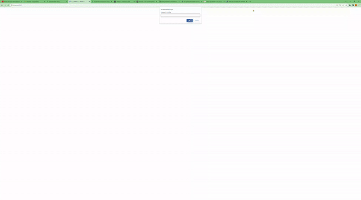

<div align="center">
  <h1>Concentration or Memory Game</h1>
  <p>
    El proposito de este repositorio es crear un juego de concentración y memoria, donde podremos jugar a dar vuelta dos cartas y juntar pares
  </p>
</div>


<h2>Instalación</h2>

Instalar con npm:

```bash
npm install
```

<h2>Introducción</h2>

El juego trata de un conjunto de naipes, en el cuál podremos dar vuelta un naipe, luego dar vuelta otro, si son iguales sumamos un punto, si son diferentes tendrémos que voltear ambas nuevamente y volver a jugar.



<h2>Dependencias</h2>

```bash
  "dependencies": {
    "@types/webpack": "^5.28.2",
    "pinia": "^2.1.6",
    "vue": "^3.3.4"
  },
  "devDependencies": {
    "@babel/preset-env": "^7.22.15",
    "@babel/preset-typescript": "^7.22.15",
    "@types/webpack-dev-server": "^4.7.2",
    "babel-loader": "^9.1.3",
    "css-loader": "^6.8.1",
    "css-minimizer-webpack-plugin": "^5.0.1",
    "dotenv-webpack": "^8.0.1",
    "file-loader": "^6.2.0",
    "html-webpack-plugin": "^5.5.3",
    "mini-css-extract-plugin": "^2.7.6",
    "node-sass": "^9.0.0",
    "sass": "^1.67.0",
    "sass-loader": "^13.3.2",
    "style-loader": "^3.3.3",
    "ts-loader": "^9.4.4",
    "ts-node": "^10.9.1",
    "typescript": "^5.2.2",
    "url-loader": "^4.1.1",
    "vue-loader": "^17.2.2",
    "vue-template-compiler": "^2.7.14",
    "webpack": "^5.88.2",
    "webpack-cli": "^5.1.4",
    "webpack-dev-server": "^4.15.1"
  }
```
